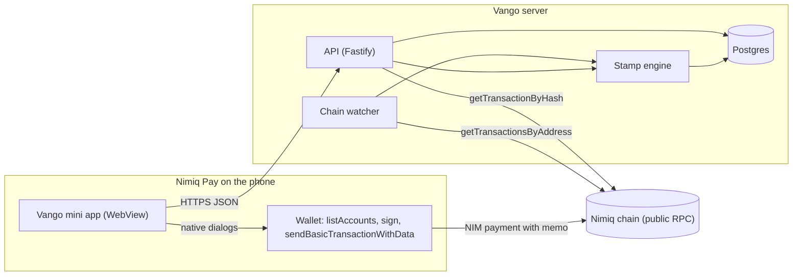
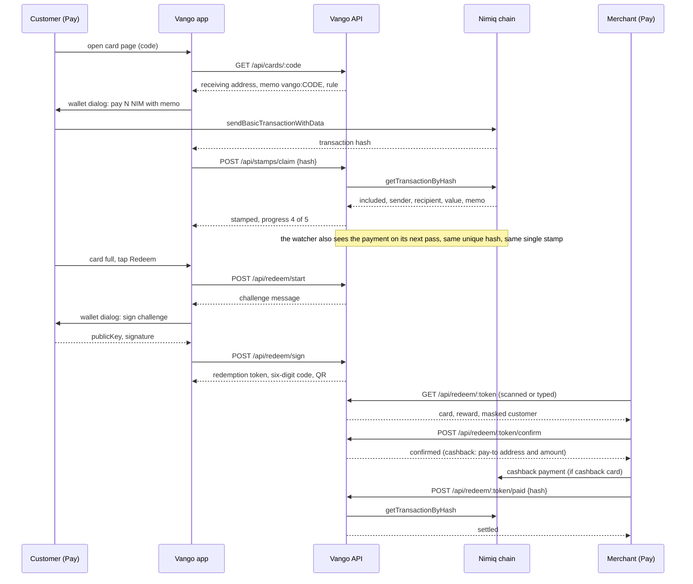
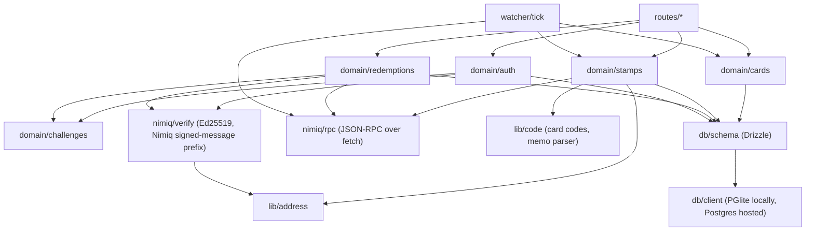

# Vango architecture

Vango is a loyalty card that lives in the customer's Nimiq Pay wallet. A merchant creates
a card. A customer pays the merchant in NIM with a short memo. The Nimiq chain is the
ledger of stamps; the Vango server only indexes and verifies. Redemption is a wallet
signature nobody can forge. Vango never holds anyone's money.

## System overview

## Main sequence: one visit, one stamp, one reward

## Module dependency graph

## What the phone reads and writes

Wallet calls the mini app makes inside Nimiq Pay (all native dialogs except the reads):

| Purpose | Call |
|---|---|
| Who is here | `listAccounts()` returns the visible address and the remote account that pays |
| Wallet ready | `isConsensusEstablished()` (false for a few seconds after launch), `getBlockNumber()` |
| Log in, redeem | `sign(message)` returns hex publicKey and signature |
| Pay with a stamp | `sendBasicTransactionWithData({ recipient, value, data: "vango:CODE" })` returns the hash |
| Cancel | throws `Error("User rejected the request.")`, matched by message |

API the mini app calls (JSON, `Authorization: Bearer vs1...` where marked):

| Route | Auth | Purpose |
|---|---|---|
| POST /api/auth/challenge | no | login message to sign |
| POST /api/auth/verify | no | signature in, session token out, stamps attached |
| GET /api/me | yes | user, owned cards, held cards with progress |
| POST /api/cards | yes | merchant creates a card; it receives at the merchant's own wallet address |
| GET /api/cards/:code | no | what to pay, where, with which memo |
| PATCH /api/cards/:code | owner | pause or resume a card |
| POST /api/stamps/claim | yes | the two-second stamp by transaction hash; a stamped result carries the block it landed in |
| GET /api/wallet | yes | the customer's cards and progress |
| POST /api/redeem/start | yes | redemption challenge |
| POST /api/redeem/sign | yes | signed challenge in, token, six-digit code and QR out |
| GET /api/redeem/:tokenOrCode | owner | merchant reads a redemption |
| POST /api/redeem/:token/confirm | owner | reward handed over (cashback: pay-to details) |
| POST /api/redeem/:token/paid | owner | cashback settled by hash |

## Trust rules, each with what enforces it

- A stamp is a confirmed on-chain payment to the card's receiving address (always the
  merchant's own wallet) with the card's memo, at or above the card's minimum, from an
  address that is not the merchant's. Enforced in `domain/stamps.recordPayment`, unique
  index on the transaction hash.
- A login or redemption is a signature over a single-use, ten-minute challenge, verified
  against the Ed25519 key that derives to the claimed address. Enforced in
  `nimiq/verify` and `domain/challenges`.
- One pending reward per card and customer, enforced by a partial unique index. A
  redemption token is stored hashed, expires in ten minutes, can be read and confirmed
  only by the merchant who owns the card, and a cashback hash settles at most one
  redemption. Enforced in `domain/redemptions`, unique indexes.
- Session tokens carry the `vs1.` prefix, are stored hashed, and are never a record id.
- Rate limits count by IP. Every failed auth, rate-limit hit and money event is logged.

## Where it runs

- Mini app and landing: Vercel, https://vango-card.vercel.app, which rewrites `/api/*`
  to the API host.
- API and watcher: two Railway services from one image (`packages/server/Dockerfile`),
  API at https://api-production-3607.up.railway.app.
- Database: Railway Postgres, `DATABASE_URL`. Locally and in tests: PGlite, no install.
- Network follows the wallet: one deployment per network (`NIMIQ_NETWORK`); the live
  deployment is mainnet, the prove-it command runs on testnet.
