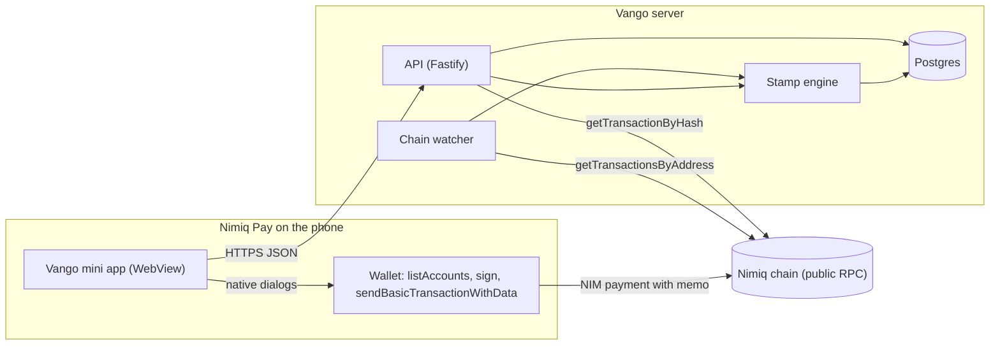
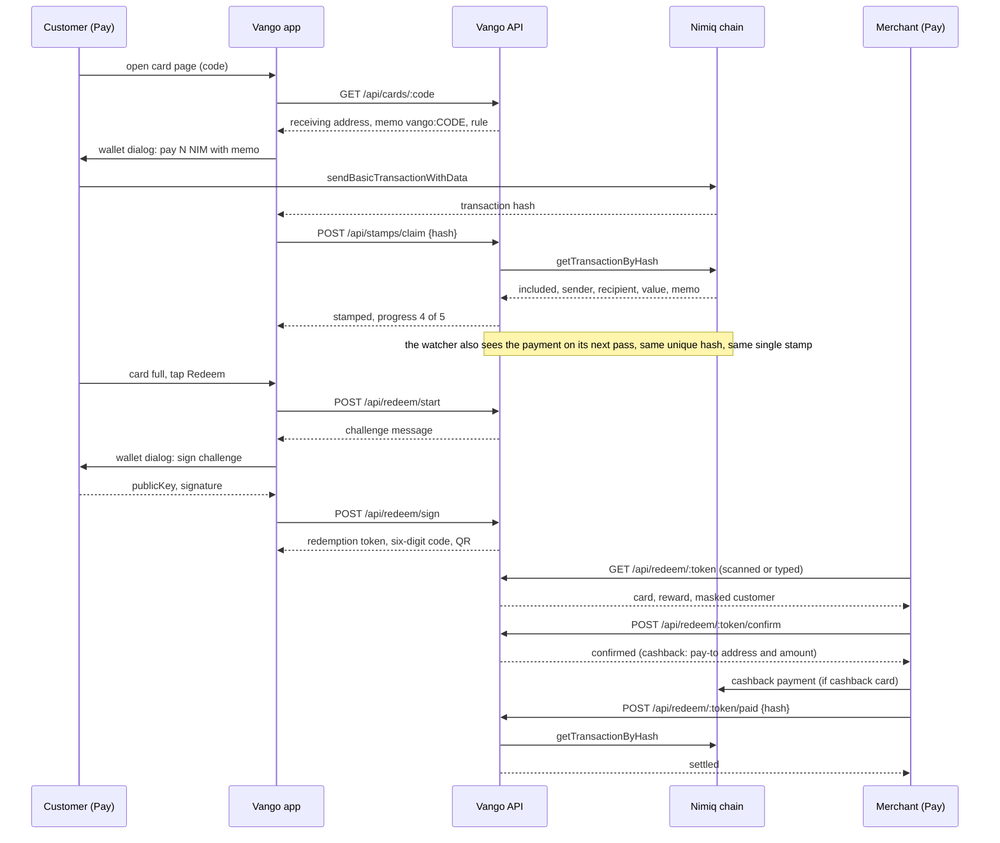
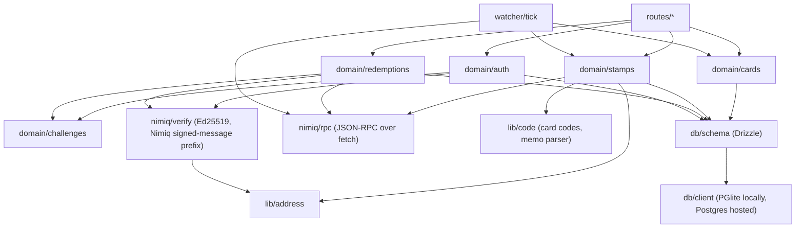

# Vango

A loyalty card that lives inside a customer's Nimiq Pay wallet. A shop creates a card,
a customer pays with a memo, the Nimiq chain is the stamp ledger, and nobody but the
two wallets ever touches the money.

The name comes from "vaanga", the word a Tamil shopkeeper calls out to bring you in
the door.

<p>
  
</p>

[Live app](https://vango-card.vercel.app) · [Docs](https://vango-card.vercel.app/docs) · [Open in Nimiq Pay](https://nimpay.app/miniapps/open/vango-card.vercel.app)

## Live deployments

| What | Value |
|---|---|
| App | `https://vango-card.vercel.app` |
| Docs | `https://vango-card.vercel.app/docs` |
| API host | `https://api-production-3607.up.railway.app` |
| Network | Nimiq mainnet (the prove-it command and the demo card run on testnet) |
| Testnet demo card | `5FQQ2J56`, receiving at [`NQ63 NLNX 4H6R M3R4 XB92 8Y1X 5GTS JUGC 5QFJ`](https://test.nimiq.watch/address/NQ63NLNX4H6RM3R4XB928Y1X5GTSJUGC5QFJ) |

## Overview

A shop gets a stamp card with no terminal to buy, no monthly fee and no deposit. Money
from a customer's payment lands straight in the shop's own wallet, the same one that
created the card. A customer gets a stamp card that lives in the wallet they already
have, no app to install and no account to create: paying the shop and earning the
stamp are the same action. Nimiq is the reason this works without a database of trust:
the chain is a payment ledger anybody can read, so a stamp is just a Vango server
reading a real payment back, and a reward is a wallet signature nobody can forge.

| | Paper stamp card | Loyalty app (Square, Stamp Me) | Vango |
|---|---|---|---|
| What the customer installs | Nothing, but the card is lost easily | A dedicated app, a new account | Nothing new: it opens inside Nimiq Pay |
| Who can fake a stamp | Anyone with a pen | The shop, by tapping the button without a sale | Nobody: a stamp is a confirmed on-chain payment the server fetched itself |
| Who holds the money | Cash in the till, no record | The platform, until it settles to the shop | Nobody: payment and cashback go wallet to wallet directly |
| Fee to the shop | None, but no data either | A monthly fee, sometimes a per-transaction cut | Nimiq network fees are zero, no platform fee |
| What proves a visit | Nothing, a stamp is just ink | A tap in the platform's own database | A transaction hash anyone can check on a public block explorer |

## Features

**For customers**
- Open a card from a link, a QR code or a typed short code, and see the reward, the
  rule and the minimum payment before paying anything.
- Pay and get stamped in one wallet action: Nimiq Pay's normal send dialog, with the
  card's memo already filled in.
- A stamp lands even if the app is closed right after paying: a server-side watcher
  catches the same payment on its next pass, and the same payment can never be
  counted twice.
- One wallet signature redeems a full card: a QR code and a six-digit code, both good
  for ten minutes.

**For shops**
- Create a card with one signature and four fields: name, reward, rule, minimum.
- Two reward rules: every Nth visit free, or cashback as a percentage of every
  payment.
- A card always receives at the shop's own wallet address. There is no field to type
  a different one, so nobody, including the shop, can point a card at somebody else's
  wallet or farm their own stamps.
- Pause a card at any time; stamps already earned stay valid.

**For the ecosystem**
- Every stamp is a real NIM payment with a memo, not a mocked event: the loyalty
  program is also organic on-chain payment volume for the shop.
- Login and redemption use Ed25519 wallet signatures, no password and no email,
  proving identity the same way the chain already does.
- Cashback payouts are themselves NIM payments the server verifies on-chain before
  marking a reward settled, so the loyalty layer never needs its own escrow.

## Testnet deployment

| What | Value | Explorer |
|---|---|---|
| Demo card | `5FQQ2J56`, "Free coffee on visit 3" | |
| Merchant address | `NQ63 NLNX 4H6R M3R4 XB92 8Y1X 5GTS JUGC 5QFJ` | [test.nimiq.watch](https://test.nimiq.watch/address/NQ63NLNX4H6RM3R4XB928Y1X5GTSJUGC5QFJ) |
| RPC endpoint | `https://rpc.testnet.nimiqwatch.com` | |
| Network | TestAlbatross | [test.nimiq.watch](https://test.nimiq.watch) |

## How it works

### System overview



Two paths reach the chain. The wallet sends the payment directly, and the server only
ever reads: the watcher scans each merchant's address on a timer, and the API
double-checks a single transaction hash the moment the app reports it. Neither path
can move money; both can only see it.

### Main sequence: one visit, one stamp, one reward



This is the whole product in one diagram: a payment becomes a stamp because the
server looked it up on the chain, not because the app said so, and a reward is handed
over only after a signature the shop's screen can check against the address on chain.

### Module dependency graph



Every route calls into a domain module, and every domain module that touches money
goes through the same two chokepoints: `nimiq/verify` for signatures and `nimiq/rpc`
for reading the chain. Neither the routes nor the watcher talk to the chain or check
a signature on their own.

## The two-minute judge path

Inside Nimiq Pay on a phone:

1. Open `https://vango-card.vercel.app` through the Pay deep link above, or paste it into Pay's
   Custom URL field.
2. Approve the one login signature Pay asks for.
3. Open the demo card, code `5FQQ2J56`.
4. Tap **Pay and stamp**, confirm the payment in Pay.
5. Watch the stamp land with the block number it was included in.
6. Open the wallet screen and see the card's progress.
7. Once the card is full, tap **Redeem** to see the QR and six-digit code.

Then, on a machine with the repo cloned, prove every claim above against the live
chain with one command:

```bash
cd packages/server && npm run prove
```

Expected output, the real run from 12 September 2026 with a payment made from an
actual phone inside Nimiq Pay:

```
   step  result   check
      1  PASS     Boot: database, migrations and the live chain
      2  PASS     Seed: the demo merchant and their card
      3  PASS     A real payment from a phone becomes a stamp
      4  PASS     Attack: the merchant pays their own counter to farm stamps
      5  PASS     Attack: the same payment claimed twice
      6  PASS     Attack: a payment under the card minimum
      7  PASS     Attack: a login signature sent twice
      8  PASS     Attack: taking the reward before the card is full
      9  PASS     Attack: a stranger confirming another merchant's reward
     10  PASS     Attack: settling cashback with a stranger's payment

prove-it finished, 10 of 10 checks passed
```

The real phone payment behind step 3, exactly as recorded:

```
3. A real payment from a phone becomes a stamp
   Pay 1 NIM from Nimiq Pay (testnet) to NQ63NLNX4H6RM3R4XB928Y1X5GTSJUGC5QFJ with memo vango:5FQQ2J56,
   or press Enter to skip
   hash   e37dde859da8f0e451769d7afba8a732e7e906f434d6afc9e55d409aa5940a08
   block  11222943
   sender NQ5492V5S1C3EAJFHVE6B2KB8U316D3DVUMC
   PASS  a live payment was read off the chain and stamped
```

## Quick start

```bash
git clone https://github.com/ramakrishnanhulk20/Vango
cd vango
npm install
```

Copy the environment file and fill it in:

```bash
cp .env.example .env
```

| Key | What it is |
|---|---|
| `NIMIQ_RPC_URL` | The public Nimiq JSON-RPC node the server reads the chain through |
| `NIMIQ_NETWORK` | `TestAlbatross` or `MainAlbatross`, must match the RPC node above |
| `SPIKE_MERCHANT_PRIVATE_KEY` | 64-character hex key of the merchant wallet used for local seeding and the prove-it run, generate with `npm run spike:genkey` inside `packages/server` |
| `PORT` | Port the API server listens on |
| `DATABASE_URL` | Hosted Postgres (Neon) connection string; leave blank to use the local PGlite database, which needs no install |
| `WATCHER_INTERVAL_MS` | How often the chain watcher checks each merchant address, in milliseconds |
| `ALLOWED_ORIGINS` | Browser origins allowed to call the API, comma separated; leave blank for same-origin only |

Then, from `packages/server`:

```bash
npm run seed
npm run dev
npm run watcher
```

And from `packages/web`, in another terminal:

```bash
npm run dev
```

To try it on a real phone, tunnel the web dev server over HTTPS and open it through
Nimiq Pay's Custom URL field:

```bash
cloudflared tunnel --url http://localhost:3000
```

Switch Nimiq Pay to testnet mode first (long-press the settings button for ten
seconds, then turn testnet mode on) and tap its faucet for 110,000 free test NIM.
Paste the cloudflared HTTPS address into Pay's Custom URL field; Pay keeps the domain
and drops the path, so the app has to live at `/`. Full steps are in
`packages/web/content/docs/getting-started/get-test-nim.mdx` (live at /docs/getting-started/get-test-nim).

## API

Auth: `Bearer vs1...` where the table below says "yes". Amounts are in Luna
(the smallest NIM unit).

**Auth**

| Method | Path | Auth | Body | Returns |
|---|---|---|---|---|
| POST | `/api/auth/challenge` | no | (empty) | login message and nonce to sign |
| POST | `/api/auth/verify` | no | `{ message, publicKey, signature, visibleAddress, remoteAddress?, language?, fiat? }` | session token, user |
| GET | `/api/me` | yes | | user, owned cards, held cards with progress |

**Cards**

| Method | Path | Auth | Body | Returns |
|---|---|---|---|---|
| POST | `/api/cards` | yes | `{ name, rewardKind, targetVisits?, cashbackBps?, minLuna?, rewardText }` | the created card summary |
| GET | `/api/cards/:code` | no | | what to pay, where, with which memo |
| PATCH | `/api/cards/:code` | owner | `{ active }` | updated card summary |

**Stamps**

| Method | Path | Auth | Body | Returns |
|---|---|---|---|---|
| POST | `/api/stamps/claim` | yes | `{ hash }` | stamp result, and progress if the payment was the caller's own |

**Wallet**

| Method | Path | Auth | Body | Returns |
|---|---|---|---|---|
| GET | `/api/wallet` | yes | | the customer's held cards and progress |

**Redeem**

| Method | Path | Auth | Body | Returns |
|---|---|---|---|---|
| POST | `/api/redeem/start` | yes | `{ code }` | redemption challenge message and nonce |
| POST | `/api/redeem/sign` | yes | `{ message, publicKey, signature }` | token, six-digit code, QR |
| GET | `/api/redeem/:token` | owner | | card, reward, masked customer |
| POST | `/api/redeem/:token/confirm` | owner | | confirmed (cashback: pay-to address and amount) |
| POST | `/api/redeem/:token/paid` | owner | `{ hash }` | settled |

## Tests

```
Test Files  18 passed (18)
     Tests  87 passed (87)
```

87 tests across 18 files, run with `npm test` inside `packages/server`. Alongside
unit and integration tests, this includes property tests written with `fast-check`
(for example, "stamps consumed never exceed stamps earned" and "six-digit codes
never collide among one merchant's pending rewards") and a race test that runs two
concurrent redemption signs against one full card and checks exactly one reward
opens.

## Costs

Nimiq charges zero network fees, so a stamp costs the customer nothing beyond the
payment itself, and a redemption signature costs nothing at all: it never touches
the chain. The memo carried inside a payment adds no fee either. The prove-it run
above shows this directly: "Merchant wallet before the attacks 2 NIM, after 2 NIM"
and "Nimiq fees are zero and every test payment is handed back, so the run repeats."
The server never signs a transaction and never holds a key that can move a user's
money; every payment goes wallet to wallet.

## Project structure

```
packages/
  server/   Fastify API, chain watcher, Drizzle schema, domain logic, tests
  web/      Next.js mini app: customer and merchant screens, the Nimiq Pay client
  content/docs/   the documentation, served by the app at /docs
docs/
  security/  the threat model
  proofs/    saved output of real prove-it runs against the live testnet
```

## Tech stack

| Library | Role |
|---|---|
| Nimiq Pay mini app provider (`@nimiq/mini-app-sdk`) | Wallet reads and signing dialogs inside Nimiq Pay |
| `@nimiq/core` | Nimiq primitives on the server side |
| Fastify | The API server |
| Drizzle | Database schema and queries |
| Postgres (hosted) and PGlite (local, no install) | The database |
| Next.js | The mini app frontend |
| Tailwind CSS | Styling |
| framer-motion, GSAP, Lenis | Motion and scroll |
| Fumadocs | The /docs route inside the app |

## Security

Vango never holds money: every payment and every cashback goes straight from one
wallet to another, so there is no vault to drain. A stamp is only ever written from
a payment the server fetched and checked itself. A login or a redemption needs a
wallet signature over a single-use, time-limited challenge. Every attack the threat
model names has a script that tries it against the live testnet, and the output is
saved under `docs/proofs/`. This is self-audited: no outside firm has reviewed it,
and the weaknesses we chose not to fix are stated plainly in the threat model rather
than left implicit. Full detail: `docs/security/threat-model.md`.

## Licence

MIT.

## Acknowledgments

Built on Nimiq Pay and the Nimiq Mini Apps Framework, reading the Nimiq testnet
through the public RPC node provided by nimiqwatch.
