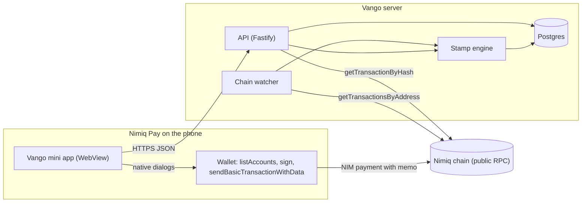
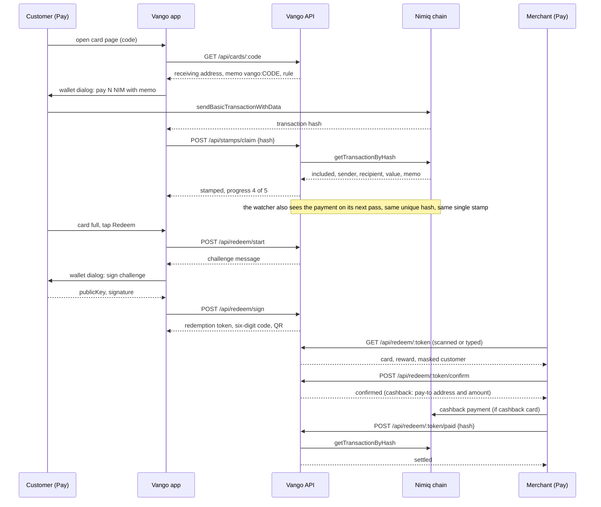
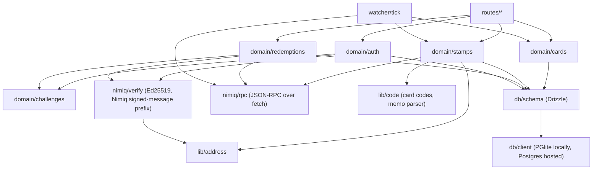

# Architecture

Vango is a loyalty card that lives in the customer's Nimiq Pay wallet. A merchant creates a
card. A customer pays the merchant in NIM with a short memo. The Nimiq chain is the ledger of
stamps; the Vango server only indexes and verifies. Redemption is a wallet signature nobody
can forge. Vango never holds anyone's money.

## System overview

Three pieces: the mini app inside Nimiq Pay, the server, and the chain. The wallet talks to the
chain directly, never through us. The server reads the chain twice, once when a phone reports a
payment and once on the watcher's own pass.

## Main sequence: one visit, one stamp, one reward

Read this one top to bottom and you have the whole product. Note the line about the watcher:
two different readers see the same payment, and the unique index on the transaction hash means
one stamp comes out.

## Module dependency graph

Arrows point at what a module depends on. Routes know about domain code, domain code knows
about the chain and the schema, and nothing points back up.

## The modules, one line each

| Module | What it is responsible for |
|---|---|
| `routes/*` | HTTP shape only: parse the body with Zod, call one domain function, map its result to a status code |
| `domain/auth` | Login, the session token, and which addresses a signed-in wallet owns |
| `domain/cards` | Creating a card, reading it by code, and the merchant's summary counts |
| `domain/stamps` | The stamp rules: what a payment has to satisfy, and a card's progress |
| `domain/redemptions` | Starting, signing, reading, confirming and settling a reward |
| `domain/challenges` | Single-use, ten-minute messages for login and redemption |
| `domain/wallet` | The cards a customer holds, with progress on each |
| `nimiq/verify` | Ed25519 verification over the Nimiq signed-message prefix, and address derivation |
| `nimiq/rpc` | JSON-RPC over fetch against a public Nimiq node |
| `watcher/tick` | One pass over every active receiving address, paged, with a moving cursor |
| `lib/code` | Card codes and the memo parser |
| `lib/address` | Normalising a Nimiq address so two spellings of it compare equal |
| `db/schema` | The Drizzle tables and every unique index the trust rules lean on |
| `db/client` | PGlite locally and in tests, hosted Postgres in production, the same code above it |

## What the phone reads and writes

Wallet calls the mini app makes inside Nimiq Pay, all native dialogs except the reads:

| Purpose | Call |
|---|---|
| Who is here | `listAccounts()` returns the visible address and the remote account that pays |
| Wallet ready | `isConsensusEstablished()` (false for a few seconds after launch), `getBlockNumber()` |
| Log in, redeem | `sign(message)` returns hex publicKey and signature |
| Pay with a stamp | `sendBasicTransactionWithData({ recipient, value, data: "vango:CODE" })` returns the hash |
| Cancel | throws `Error("User rejected the request.")`, matched by message |

Every route the mini app calls is listed with its body, response and errors in the
[API reference](./api.md).

## Where it runs

- API and mini app: Vercel.
- Watcher: one small always-on process (Fly.io, Railway or a VPS with pm2).
- Database: Neon Postgres, `DATABASE_URL`. Locally and in tests: PGlite, no install.
- Network follows the wallet: one deployment per network (`NIMIQ_NETWORK`).
