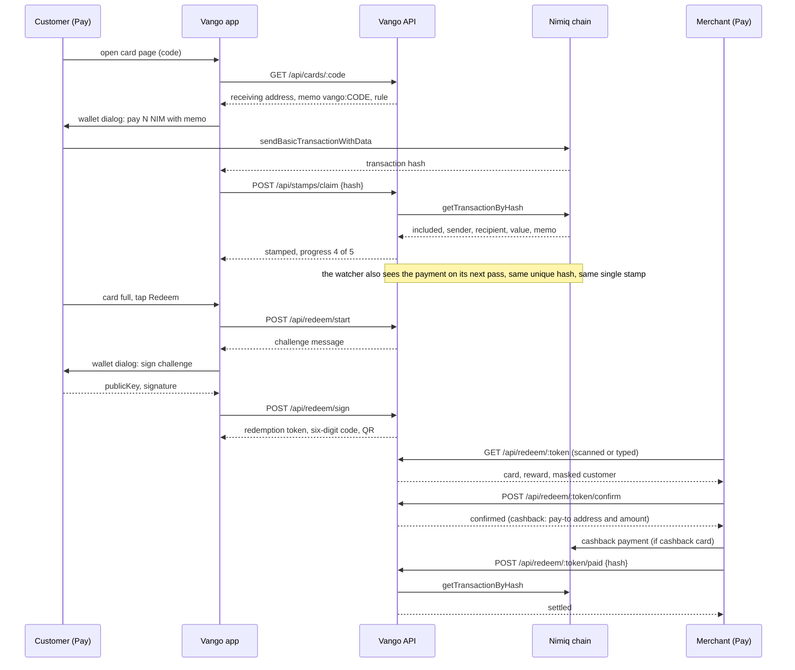

A paper stamp card works because both sides can see it. Vango keeps that and moves the
card onto the Nimiq chain, where neither side can quietly change it.

## The loop in five steps

**1. A merchant opens a card.** They say what the card is called, what the reward is, and
which of two rules it follows: every Nth visit free, or a share of every payment back as
cashback. The card gets a short code like `5FQQ2J56` and receives at the merchant's own
wallet address. Vango does not choose that address and cannot change it.

**2. A customer opens the card.** From a link, a QR on the counter, or the code. The card
page shows the reward, the minimum payment, and the address the money goes to.

**3. The customer pays, and the payment is the stamp.** Nimiq Pay sends NIM from the
customer's wallet straight to the merchant's wallet, with the card's memo attached:
`vango:5FQQ2J56`. Nothing passes through Vango. The fee is zero.

**4. The server reads the payment back off the chain.** The phone reports the transaction
hash, and the server fetches that transaction itself from a Nimiq node. If it is included,
paid to the card's address, carries the card's memo, is at or above the minimum, and did
not come from the merchant, it becomes one stamp. A chain watcher makes the same pass in
the background, so a customer who closes the app still gets their stamp.

**5. The reward is a signature.** When the card is full the customer taps Redeem and signs
a message naming that card. The server turns the signature into a six-digit code and a QR.
The merchant scans or types it, sees the reward and a masked customer address, and confirms.
On a cashback card, the confirmation tells the merchant's phone exactly what to pay, and the
server then checks that payment on the chain before the reward counts as settled.

## The same loop as a diagram

## What this buys each side

- The customer keeps no plastic and installs nothing. Their stamps are payments on a public
  chain, so they can prove a visit even if Vango disappears.
- The merchant runs a loyalty programme without a terminal, a subscription or a card
  printer, and every NIM a customer spends lands in their own wallet within a second.
- Neither side has to trust Vango with money, because Vango never has any.

Read on: [Why Nimiq Pay](/docs/concepts/why-nimiq-pay) for the wallet features this depends on, and
[Trust model](/docs/concepts/trust-model) for what counts as a stamp and what Vango will never do.
